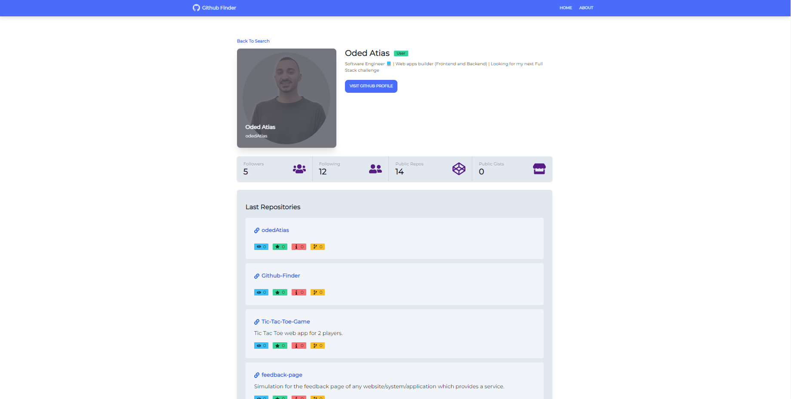

# Github-Finder 🔎

A project to create a  search engine Github users.



## Technologies

👉 REACT.JSX

👉 Tailwind

## Implementation Remarks

1️⃣ I have added to the project 3 main components types that will help me perform the task in a simpler:

1. Search component - The component that will allow users to be searched.
2. Results - A component that will contain the search results.
3. User's profile - A components that will display the data of each user.

2️⃣ I used the routing library 'react-router-dom' version v6.

3️⃣ I used the Joi library to validate the feedback input.

4️⃣ I used the useContext and useReducer hooks in order to manage the state globally.

5️⃣ I used axios to interface with the Github API.

## External style libraries

🔹 Google Fonts.

🔹 DaisyUI.

🔹 React icons.

## Usage

```
~$: npm i
~$: npm start
```

## for any questions

```
if(haveAnyQuestions === true){
    let yourName = ".......", question = ".......";
    sendEmailToMe(yourName,question,odedatias8115@gmail.com);
}
```
